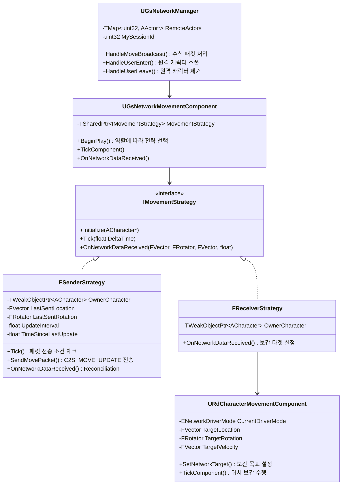
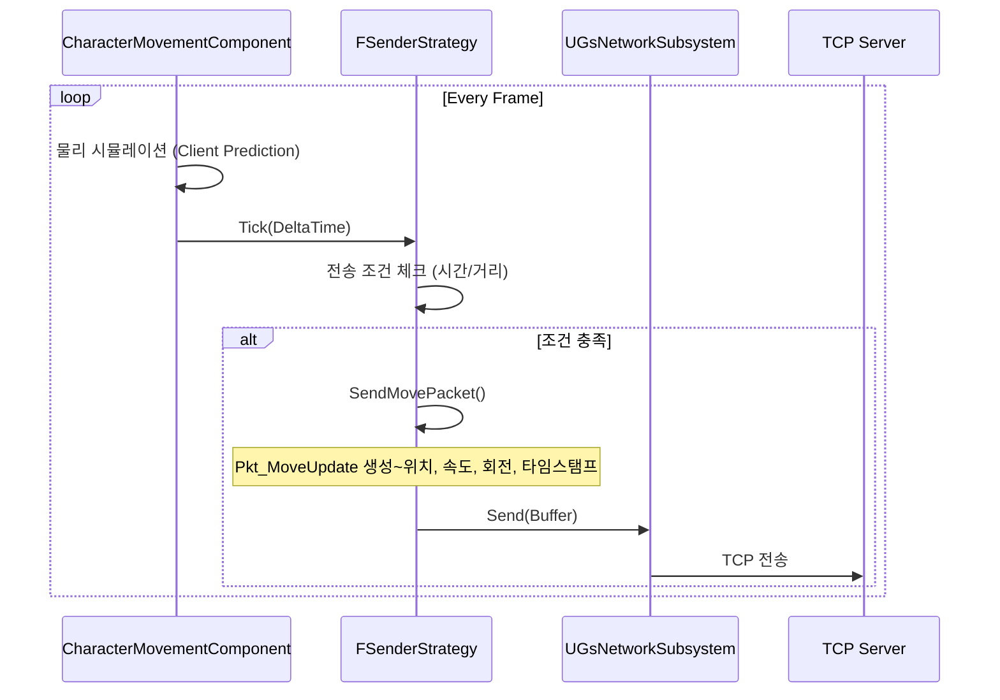
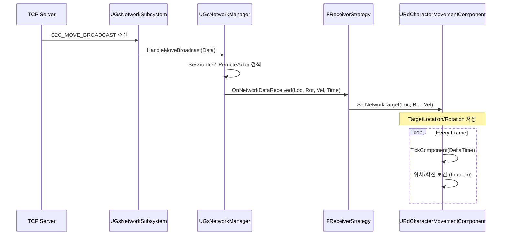

# 네트워크 이동 동기화 시스템 문서

## 개요
TCP 기반 커스텀 이동 동기화 시스템으로, Strategy 패턴을 사용하여 로컬 캐릭터(Sender)와 원격 캐릭터(Receiver)의 이동 로직을 분리합니다.

---

## 클래스 다이어그램



---

## 시퀀스 다이어그램

### 1. 이동 패킷 송신 (로컬 → 서버)



### 2. 이동 패킷 수신 (서버 → 원격 캐릭터)



---

## 핵심 동기화 메커니즘

### 1. Client-Side Prediction
- 로컬 캐릭터는 `UCharacterMovementComponent`의 기본 물리 시뮬레이션 사용
- 서버 응답을 기다리지 않고 즉시 이동 → **반응성 확보**

### 2. Rate-Limited Packet Sending
```cpp
// SenderStrategy.cpp
if (TimeSinceLastUpdate >= UpdateInterval) { // 기본 0.05초
    bShouldSend = true;
}
// 또는 위치/회전 변화가 임계값 초과 시 즉시 전송
if (DistSq > 25.0f || bRotChanged) {
    bShouldSend = true;
}
```
- 네트워크 부하 감소 + 중요 변화 시 즉시 반영

### 3. Dead Reckoning (수신 측)
- `Pkt_MoveUpdate`에 **속도(vx, vy, vz)**와 **타임스탬프** 포함
- 수신 측에서 패킷 간 시간 동안 속도 기반 예측 가능 (구현 확장 가능)

### 4. 위치 보간 (Interpolation)
```cpp
// RdCharacterMovementComponent::TickComponent
FVector NewLoc = FMath::VInterpTo(CurrentLoc, TargetLocation, 
                                   DeltaTime, LocationInterpSpeed);
FRotator NewRot = FMath::RInterpTo(CurrentRot, TargetRotation, 
                                    DeltaTime, RotationInterpSpeed);
```
- 원격 캐릭터의 끊김 없는 부드러운 이동 보장

### 5. Server Reconciliation
```cpp
// SenderStrategy::OnNetworkDataReceived
if (FVector::Dist(CurrentLoc, ServerLoc) > 200.0f) {
    Char->SetActorLocation(ServerLoc); // Snap
}
```
- 서버 권위: 오차가 임계값 초과 시 강제 보정

---

## 패킷 구조

| 필드 | 타입 | 설명 |
|------|------|------|
| size | uint16 | 패킷 크기 |
| type | uint16 | PacketType (3=C2S, 4=S2C) |
| sessionId | uint32 | 유저 식별자 |
| x, y, z | float | 위치 |
| vx, vy, vz | float | 속도 (Dead Reckoning용) |
| pitch, yaw, roll | float | 회전 |
| timestamp | uint64 | 밀리초 타임스탬프 |

---

## 관련 파일

| 파일 | 역할 |
|------|------|
| [Protocol.h](file:///c:/Users/COM2US/Documents/Unreal%20Projects/RdGame/Source/RdGame/Network/Protocol.h) | 패킷 구조 정의 |
| [GsNetworkManager.cpp](file:///c:/Users/COM2US/Documents/Unreal%20Projects/RdGame/Source/RdGame/Network/GsNetworkManager.cpp) | 패킷 핸들러 등록 및 처리 |
| [GsNetworkMovementComponent.cpp](file:///c:/Users/COM2US/Documents/Unreal%20Projects/RdGame/Source/RdGame/Network/GsNetworkMovementComponent.cpp) | Strategy 선택 로직 |
| [SenderStrategy.cpp](file:///c:/Users/COM2US/Documents/Unreal%20Projects/RdGame/Source/RdGame/Network/Strategies/SenderStrategy.cpp) | 송신 로직 |
| [ReceiverStrategy.cpp](file:///c:/Users/COM2US/Documents/Unreal%20Projects/RdGame/Source/RdGame/Network/Strategies/ReceiverStrategy.cpp) | 수신 로직 |
| [RdCharacterMovementComponent.h](file:///c:/Users/COM2US/Documents/Unreal%20Projects/RdGame/Source/RdGame/Character/RdCharacterMovementComponent.h) | 하이브리드 이동 컴포넌트 |
