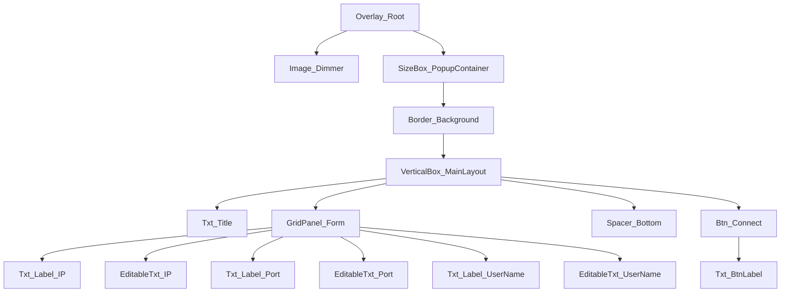

# WBP_ConnectionDialog Hierarchy

## 🏛️ Design Philosophy (Gemini UMG Architect)
- **Root Strategy**: Uses an `Overlay` as the root to handle screen-size dimming and popup centering without `CanvasPanel` cost.
- **Layout**: Uses `VerticalBox` for the main stack and `GridPanel` for the form to ensure perfect alignment of labels and input boxes without manual pixel adjustment.
- **Optimization**: No `CanvasPanel` used inside the popup. Minimized hierarchy depth.
- **Naming**: `[Prefix]_[Function]_[Description]`

## 🌳 Widget Hierarchy

## 📝 Detailed Tree Structure & Properties

### **[Root] Overlay** (`WBP_ConnectionDialog`)
*   **Significance**: Covers the entire viewport.
*   **Anchors**: (Full Screen via Overlay Slot)

    ### 1. **Image** (`Image_Dimmer`)
    *   **Role**: Modal background dimmer.
    *   **Appearance**: Color `#000000`, Alpha `0.5`.
    *   **Layout (Overlay Slot)**: 
        *   `Horizontal Alignment`: **Fill**
        *   `Vertical Alignment`: **Fill**

    ### 2. **Size Box** (`SizeBox_PopupContainer`)
    *   **Role**: Constraints the popup size and centers it.
    *   **Settings**: `Width Override`: ~500, `Height Override`: ~350 (Adjust to taste).
    *   **Layout (Overlay Slot)**:
        *   `Horizontal Alignment`: **Center** (This acts as the Anchor)
        *   `Vertical Alignment`: **Center**

        ### 3. **Border** (`Border_Background`)
        *   **Role**: The popup window background.
        *   **Appearance**: Brush Color (Dark Gray / Glassmorphism), Rounded Corners.
        *   **Padding**: 0

            ### 4. **Vertical Box** (`VerticalBox_MainLayout`)
            *   **Role**: Stacks Title, Form, and Button.
            *   **Padding**: Left: 30, Top: 30, Right: 30, Bottom: 30.

                #### A. **Text Block** (`Txt_Title`)
                *   **Content**: "텍스트 블록" (or "Connection Setup")
                *   **Font**: Bold, Size 20.
                *   **Padding (Slot)**: Bottom: 30.
                *   **Alignment**: Center/Left.

                #### B. **Grid Panel** (`GridPanel_Form`)
                *   **Role**: Aligns Label (Left) and Input (Right) perfectly.
                *   **Column Fill**: Column 1 (Inputs) should have `Weight: 1.0` to fill space.

                    *   **Row 0**:
                        *   `Txt_Label_IP` (Text): "IP", VAlign: Center.
                        *   `EditableTxt_IP` (EditableText): Hint "127.0.0.1", Padding: 5, Style: Premium Input.
                    *   **Row 1**:
                        *   `Txt_Label_Port` (Text): "Port", VAlign: Center.
                        *   `EditableTxt_Port` (EditableText): Hint "7777", Padding: 5.
                    *   **Row 2**:
                        *   `Txt_Label_UserName` (Text): "유저이름", VAlign: Center.
                        *   `EditableTxt_UserName` (EditableText): Hint "PlayerName", Padding: 5.

                #### C. **Spacer** (`Spacer_Bottom`)
                *   **Role**: Pushes the button down or adds gap.
                *   **Size**: Y = 40.

                #### D. **Button** (`Btn_Connect`) (or `WBP_RdButtonBase`)
                *   **Role**: Action triggers.
                *   **Layout (Slot)**: `Horizontal Alignment`: **Fill** (Stretches button width).
                *   **Height**: 50.
                *   **Events**: OnClicked -> ViewModel `Connect()` command.
                
                    *   **Text Block** (`Txt_BtnLabel`)
                        *   **Content**: "Connect"
                        *   **Color**: Orange/Accent.
                        *   **Alignment**: Center.

## 🔧 Optimization & MVVM Notes
1.  **Named Slots**: If the input form varies, `GridPanel_Form` could be placed inside a `Named Slot` named `ContentSlot` to make this a generic "Dialog Widget".
2.  **View Model**: creating a `VM_Connection` with properties `IPAddress`, `Port`, `UserName` and binding them Two-Way to the EditableTexts.
3.  **Invalidation**: Wrap `VerticalBox_MainLayout` in an `Invalidation Box` if the text doesn't animate, to save slate draw time.
