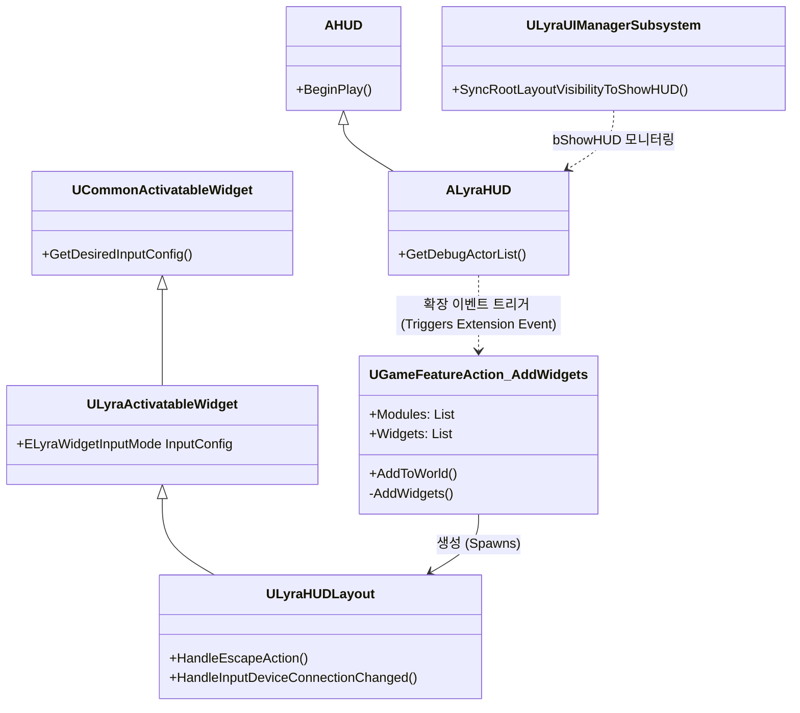
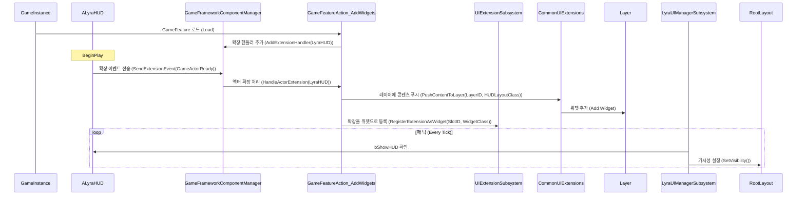

# Lyra UI 분석 및 이식 가이드

## 1. 시스템 개요 (System Overview)

Lyra의 UI 시스템은 Epic의 **CommonUI** 플러그인을 기반으로 구축되었으며, **정책 주도(Policy-driven)** 및 **확장(Extension)** 기반 아키텍처를 사용합니다. 전통적인 `AHUD` 클래스에서 벗어나, 대신 **Gameplay Tags**와 **Game Feature Actions**를 통해 상호작용합니다.

### 핵심 구성 요소 (Core Components)
- **LyraHUD (AHUD)**: 최소한의 껍데기 역할입니다. UI 초기화 시점을 알리기 위해 `GameFrameworkComponentManager`에 등록하는 앵커(Anchor) 역할을 합니다.
- **LyraHUDLayout (Widget)**: 플레이어 HUD의 최상위 루트 위젯입니다. "ESC 메뉴"나 "컨트롤러 연결 끊김" 화면 같은 상위 레벨 상태를 관리합니다.
- **GameFeatureAction_AddWidgets**: HUD를 생성(Spawn)하는 주요 메커니즘입니다. HUD 액터가 등록되는 것을 감지하고, Gameplay Tag로 정의된 특정 **UI 레이어(Layer)** 에 위젯을 밀어 넣습니다.
- **LyraUIManagerSubsystem**: 게임 인스턴스 서브시스템으로, 전역 UI 상태(Tick 등)를 관리하고 루트 레이아웃의 가시성(Visibility)을 `AHUD` 액터의 `bShowHUD` 속성과 동기화합니다.
- **CommonUI Extensions**: 하드 레퍼런스 없이 위젯을 레이어(`Game`, `Menu`, `Modal` 등)에 Push/Pop 하기 위해 `UCommonUIExtensions` 유틸리티를 적극적으로 활용합니다.

## 2. 아키텍처 다이어그램 (Architecture Diagrams)

### 클래스 구조 (Class Structure)



### 초기화 시퀀스 (Initialization Sequence)



## 3. 구현 상세 (Implementation Details)

### 파일 구조
- `Source/LyraGame/UI/LyraHUD.h/cpp`: 앵커(Anchor) 액터.
- `Source/LyraGame/UI/LyraHUDLayout.h/cpp`: 메인 HUD 로직.
- `Source/LyraGame/GameFeatures/GameFeatureAction_AddWidget.h/cpp`: 스포너(Spawner).
- `Source/LyraGame/UI/Subsystem/LyraUIManagerSubsystem.h/cpp`: 관리자(Manager).

### 주요 로직
1.  **입력 설정 (Input Configuration)**: `ULyraActivatableWidget` 래퍼를 통해 "게임(Game)" 모드(입력이 플레이어에게 전달됨)와 "메뉴(Menu)" 모드(입력을 UI가 소비함) 간의 전환을 `InputConfig` 속성 하나로 쉽게 처리합니다.
2.  **레이어링 (Layering)**: 레이어는 `GameplayTag`로 정의됩니다 (예: `UI.Layer.Game`, `UI.Layer.Menu`). 뷰포트에 수동으로 추가하는 것이 아니라, 태그가 지정된 레이어에 Push 합니다.
3.  **확장 포인트 (Extension Points)**: HUD 내의 공간(Slot)들도 태그로 정의됩니다. `GameFeatureAction_AddWidget`을 사용하면 HUD 클래스 자체를 수정하지 않고도 특정 슬롯에 위젯(예: 무기 탄약 카운터)을 주입(Inject)할 수 있습니다.

## 4. 이식 가이드 (Migration Guide: 다른 프로젝트로의 포팅)

이 시스템을 다른 언리얼 엔진 프로젝트로 포팅하려면 다음 단계를 점진적으로 수행하십시오:

### 1단계: 종속성 및 핵심 설정 (Phase 1: Dependencies & Core Setup)
1.  **플러그인 활성화**:
    *   `CommonUI`
    *   `CommonGame`
    *   `UIExtension`
    *   `GameFeatures` (선택 사항이지만 모듈성을 위해 권장)
    *   `ModularGameplay`
2.  **모듈 종속성 (Build.cs)**:
    `.Build.cs` 파일을 업데이트하여 다음을 포함하십시오:
    ```csharp
    PublicDependencyModuleNames.AddRange(new string[] { 
        "CommonUI", "CommonInput", "CommonGame", "UIExtension", "GameplayTags", "GameFeatures", "ModularGameplay" 
    });
    ```
3.  **Config 설정**:
    `DefaultGame.ini`에서 `GameUIPolicy` 클래스를 설정하십시오 (보통 `UGameUIPolicy` 또는 이를 상속받은 서브클래스).

### 2단계: 기본 클래스 (Phase 2: Base Classes)
1.  **`LyraActivatableWidget` 복사**: 매우 유용한 유틸리티입니다. `LyraActivatableWidget.h/cpp`를 프로젝트로 가져오십시오 (이름을 `YourProjectActivatableWidget`으로 변경).
2.  **HUD 액터 구현**:
    *   `AHUD`를 상속받는 `AYourHUD`를 생성합니다.
    *   `PreInitializeComponents`에서 `UGameFrameworkComponentManager::AddGameFrameworkComponentReceiver(this)`를 호출합니다.
    *   `BeginPlay`에서 `NAME_GameActorReady` 이벤트를 전송합니다.

### 3단계: 관리자 (Phase 3: The Manager)
1.  **`LyraUIManagerSubsystem` 포팅**:
    *   이 클래스를 복사합니다. 이 클래스는 게임플레이 월드(`.bShowHUD`)와 CommonUI 월드(루트 레이아웃 가시성) 간의 필수적인 동기화를 제공합니다.
    *   `UGameUIManagerSubsystem`을 상속받아야 합니다.

### 4단계: HUD 콘텐츠 (Phase 4: HUD Content)
1.  **루트 레이아웃 생성**:
    *   `YourProjectActivatableWidget`을 상속받는 위젯 블루프린트를 생성합니다.
    *   메뉴들이 위에 쌓일 수 있도록 `UCommonActivatableWidgetStack`을 추가합니다.
2.  **생성 로직 (Spawn Logic)**:
    *   **옵션 A (Game Features)**: `GameFeatureAction_AddWidget`을 포팅합니다. 가장 강력하고 모듈화된 방법입니다.
    *   **옵션 B (Simple)**: `AYourHUD::BeginPlay`에서 직접 `UCommonUIExtensions::PushContentToLayer_ForPlayer`를 호출하여 루트 레이아웃을 추가합니다.

### 5단계: 확장 시스템 (Phase 5: Extension System - 심화)
1.  개별 기능(인벤토리, 체력 바 등)이 스스로를 주입하게 하려면:
    *   HUD 레이아웃 위젯 내에서 `UUIExtensionSubsystem`을 사용합니다.
    *   일반적인 HUD 레이아웃에 `UUIExtensionPointWidget` 위젯을 추가하여 "슬롯(Slot)" 역할을 하게 합니다.
    *   서브시스템(또는 4단계의 Action)을 사용하여 해당 슬롯에 위젯을 등록합니다.
